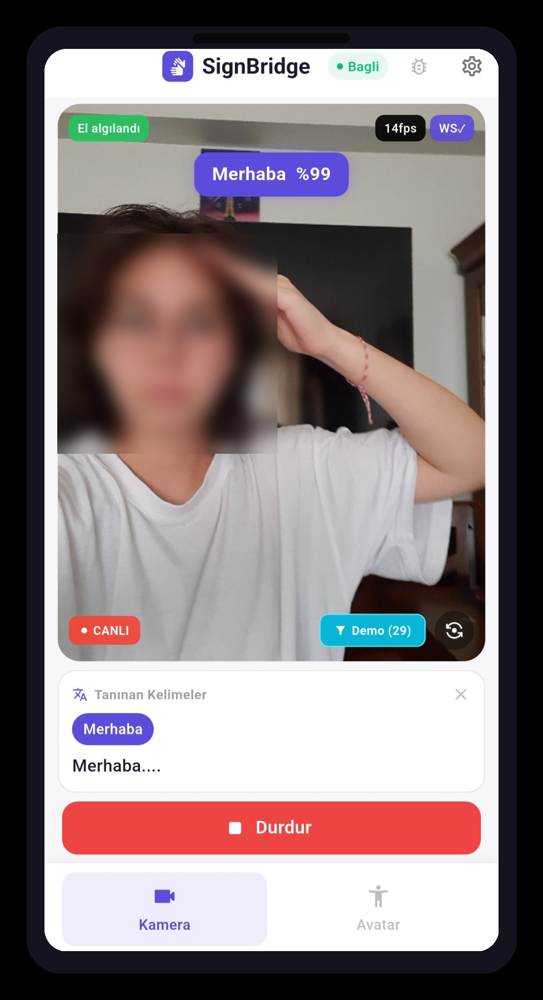
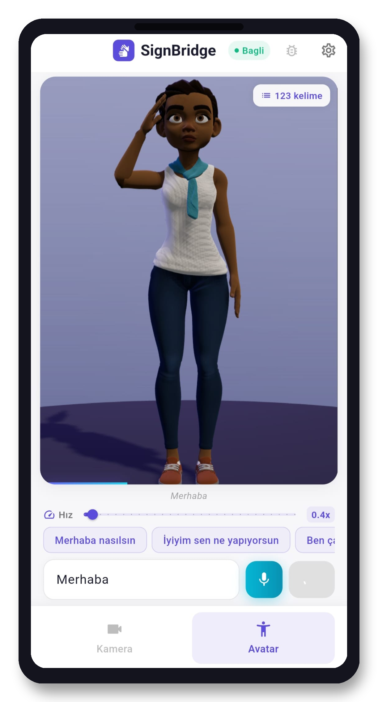
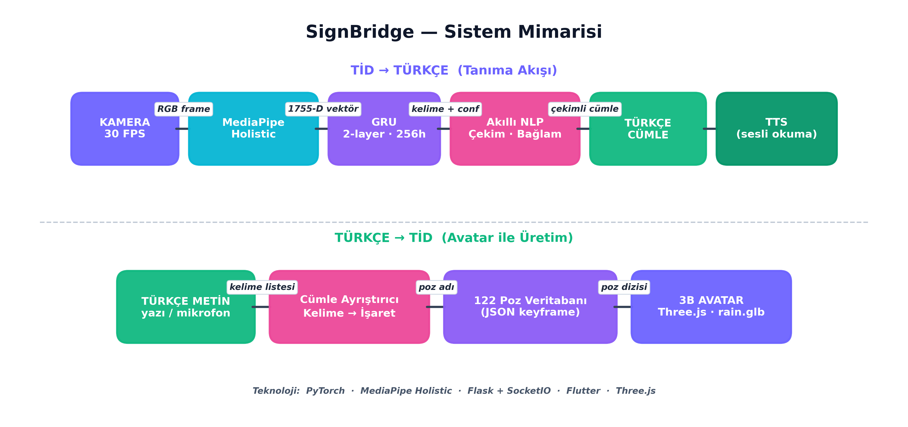
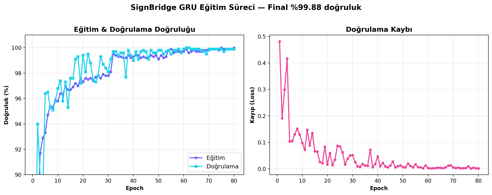
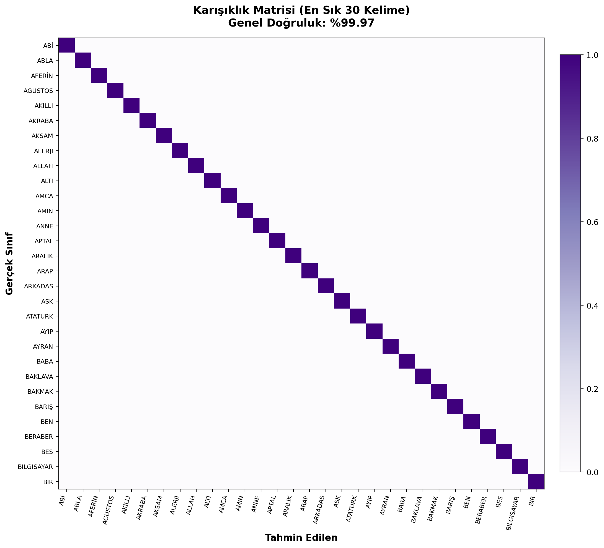

<div align="center">

# 📱 SignBridge Mobile

### Türk İşaret Dili ↔ Türkçe • Cihaz Üzerinde Çalışan Android Uygulaması

Kameraya yapılan işareti **Türkçe metne ve sese** çevirir; yazılan/söylenen Türkçeyi de **3 boyutlu avatar** ile işaret diline çevirir — hepsi **internet bağlantısı olmadan**, tamamen telefonda.


</div>

---

## 📌 Genel Bakış

**SignBridge Mobile**, [SignBridge](https://github.com/esmasila/SignBridge) projesinin Android uygulamasıdır. Flutter/Dart ile geliştirilmiştir ve **122 kelimelik** Türk İşaret Dili (TİD) sözlüğü üzerinde **çift yönlü** çeviri yapar:

- **TİD → Türkçe:** Kamera önünde yapılan işaret cihazda tanınır → akıcı Türkçe cümleye çevrilir → sesli okunur.
- **Türkçe → TİD:** Yazılan veya mikrofona söylenen Türkçe ifade, 3 boyutlu avatar ile işaret diliyle gösterilir.

> 🔌 **Tamamen çevrimdışı:** MediaPipe ile anahtar nokta çıkarımı ve ONNX modeliyle sınıflandırma **doğrudan telefonda** çalışır. Hiçbir görüntü buluta/sunucuya gönderilmez.

<div align="center">

| Kamera (TİD→Türkçe) | Avatar (Türkçe→TİD) |
|:---:|:---:|
|  |  |

</div>

---

## ✨ Özellikler

- 📴 **Cihaz üzerinde / çevrimdışı** — ONNX ile internet olmadan tahmin
- 🔄 **Çift yönlü** — TİD→Türkçe (kamera) ve Türkçe→TİD (avatar)
- 🗣️ **122 kelimelik sözlük** — web sürümüyle birebir aynı
- 🧠 **Akıllı NLP** — tanınan kelimeleri dilbilgisi kurallarıyla akıcı Türkçe cümleye çevirir (`nlp_service.dart`)
- 🔊 **Sesli giriş/çıkış** — `flutter_tts` (metinden sese) ve `speech_to_text` (sesten metne)
- 🔁 **Ön/arka kamera geçişi** — kaynaklar güvenli biçimde serbest bırakılır
- 🎯 **Demo modu** — gösterimlerde kararlılık için kelime beyaz listesi
- 🔒 **Gizlilik** — ham görüntü saklanmaz; yalnızca anahtar nokta koordinatları işlenir

---

## ⚙️ Nasıl Çalışır?

```
Kamera karesi
   ↓
MediaPipe Holistic  (543 anahtar nokta — cihazda)
   ↓
Öznitelik + 2 aşamalı normalleştirme  (1755 boyut/kare)
   ↓
ONNX GRU modeli  (cihazda çıkarım)
   ↓
Tahmin yumuşatma (güven eşiği + tekrar)
   ↓
Kural tabanlı NLP → Türkçe cümle → TTS
```

Dikey (portre) kamera ile eğitimdeki yatay en-boy oranı farkı, görüntü MediaPipe'a verilmeden önce **4:3 kenar dolgusu (padding)** ile giderilmiştir. Gerçek zamanlı eşik değerleri (güven, hızlı izleme, bekleme) web sürümüyle **bire bir aynı** tutulmuştur.

<div align="center">
  
</div>

---

## 🧠 Model

| Ölçüt | Değer |
|---|---|
| Model | 2 katmanlı GRU, 256 gizli birim (ONNX) |
| Sınıf (kelime) sayısı | **122** |
| Giriş | 30 kare × 1755 öznitelik |
| Doğrulama doğruluğu | **%99,88** |
| Test doğruluğu | **%99,97** (3.660 örnek) |

<div align="center">

| Eğitim & Doğrulama | Karışıklık Matrisi |
|:---:|:---:|
|  |  |

</div>

> Model PyTorch ile eğitilip ONNX formatına dönüştürülmüştür. Eğitim ve veri seti detayları için ana repoya bakın: **[esmasila/SignBridge](https://github.com/esmasila/SignBridge)**

---

## 🛠️ Kullanılan Teknolojiler

| Bileşen | Teknoloji |
|---|---|
| Uygulama çatısı | Flutter / Dart |
| Anahtar nokta çıkarımı | MediaPipe (cihazda) |
| Model çıkarımı | ONNX Runtime |
| Sesli okuma | flutter_tts |
| Konuşma tanıma | speech_to_text |
| 3B Avatar | Three.js (WebView) |

---

## 🚀 Kurulum & Çalıştırma

Gereksinimler: [Flutter SDK](https://docs.flutter.dev/get-started/install) ve bir Android cihaz/emülatör.

```bash
# 1) Depoyu klonla
git clone https://github.com/esmasila/SignBridge-Mobile.git
cd SignBridge-Mobile

# 2) Bağımlılıkları indir
flutter pub get

# 3) Cihaza/emülatöre çalıştır
flutter run

# 4) (İsteğe bağlı) Sürüm APK üret
flutter build apk --release
# Çıktı: build/app/outputs/flutter-apk/app-release.apk
```

---

## 📁 Proje Yapısı (özet)

```
SignBridge-Mobile/
├── lib/
│   ├── screens/
│   │   ├── camera_screen.dart    # TİD → Türkçe (kamera + tanıma)
│   │   └── avatar_screen.dart    # Türkçe → TİD (3B avatar)
│   └── services/
│       ├── nlp_service.dart      # Kural tabanlı cümle oluşturma
│       └── frame_encoder.dart    # Kare işleme / öznitelik
├── android/                      # Android yapılandırması
├── assets/                       # Model (ONNX), label_map, avatar
└── docs/screenshots/             # README görselleri
```

---

## 🔗 İlgili Proje

🌐 **Web sürümü, model eğitimi ve veri seti:** [esmasila/SignBridge](https://github.com/esmasila/SignBridge)

---

## 👩‍💻 Yazar & Danışman

- **Geliştirici:** Esma Sıla ŞAHİNCİ
- **Danışman:** Öğr. Gör. Dr. Kadir HALTAŞ
- Nevşehir Hacı Bektaş Veli Üniversitesi — Bilgisayar Mühendisliği Bölümü, Bitirme Ödevi (2026)

---

## 📄 Lisans

Bu proje MIT Lisansı altında lisanslanmıştır.

<div align="center">

*SignBridge — iletişimi herkes için erişilebilir kılmak.* 🤟

</div>
